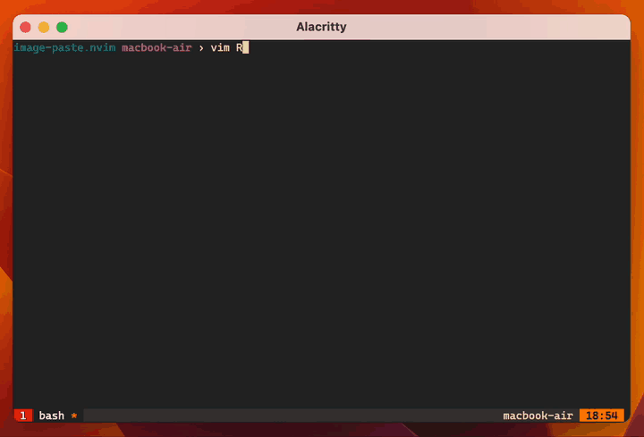

## image-paste.nvim

This small plugin lets you paste images from your clipboard into neovim. It
uploads the image to Imgur and inserts the appropriate HTML.

<center>
  
</center>

```lua
use({
  "evanpurkhiser/image-paste.nvim",
  config = function()
    require("image-paste").setup({ imgur_client_id = "<your imgur client_id>" })
  end,
})
```

([get your imgur client key here](https://api.imgur.com/oauth2/addclient))

Usage is simple, you'll probably want to map it to a keybinding

```lua
require('image-paste').paste_image()
```

image-paste is currently only tested on mac, but you can specify your own
`paste_script` command. All it needs to do is output binary to stdout.

```lua
use({
  "evanpurkhiser/image-paste.nvim",
  config = function()
    require("image-paste").setup({
      imgur_client_id = "<your imgur client_id>",
      paste_script = [[...]]
    })
  end,
})
```
